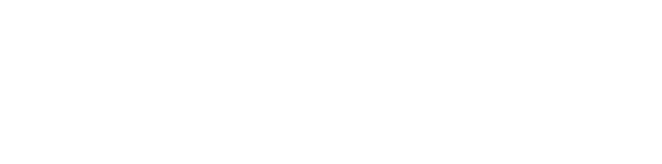
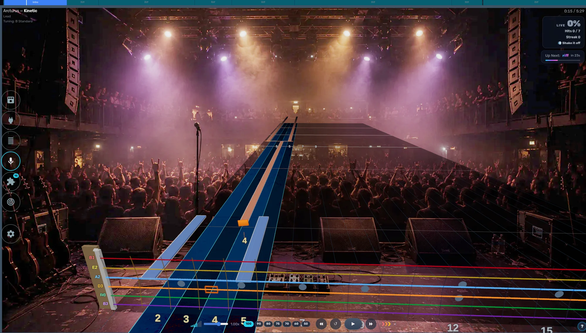
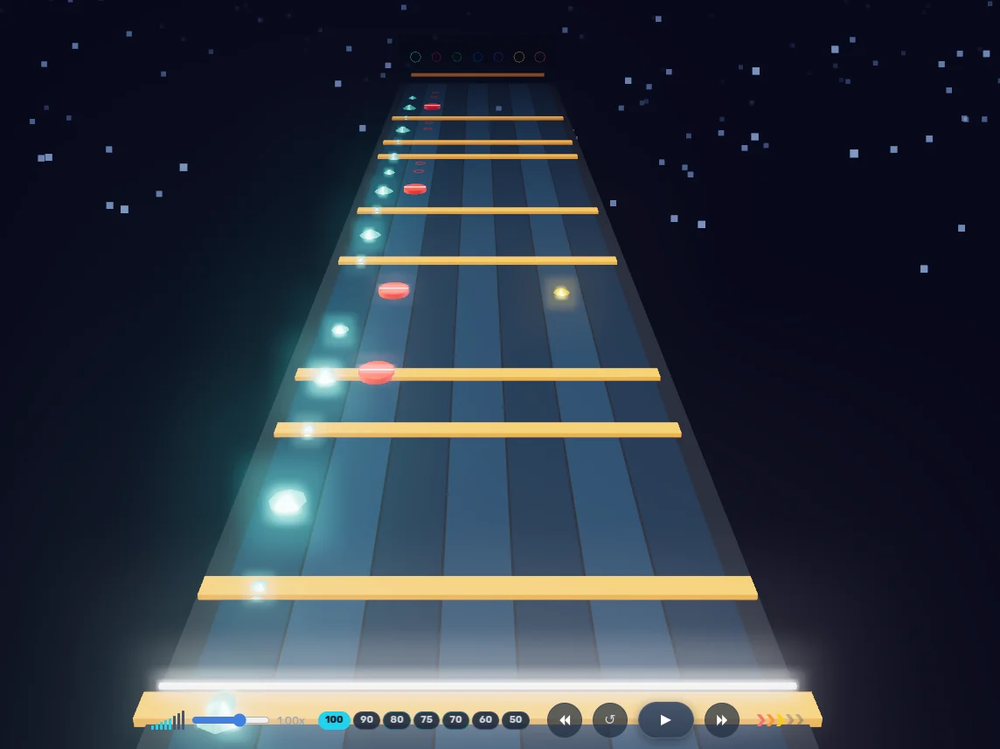
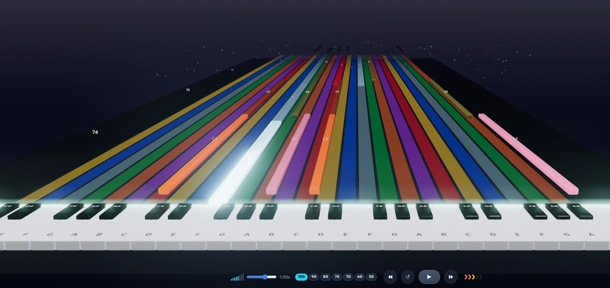
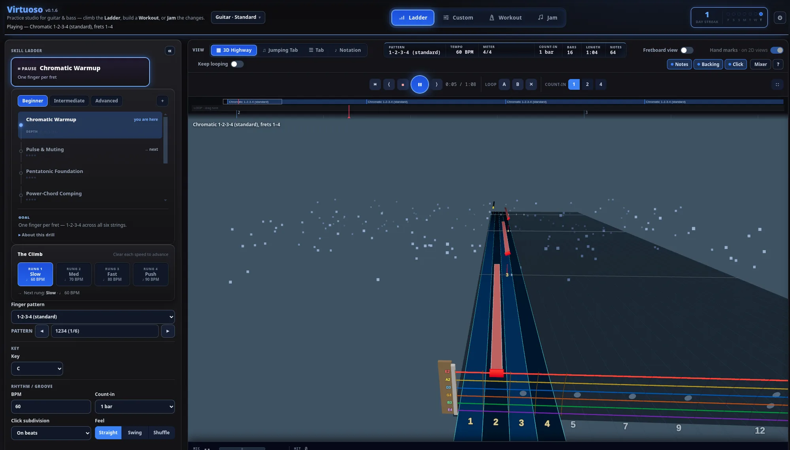
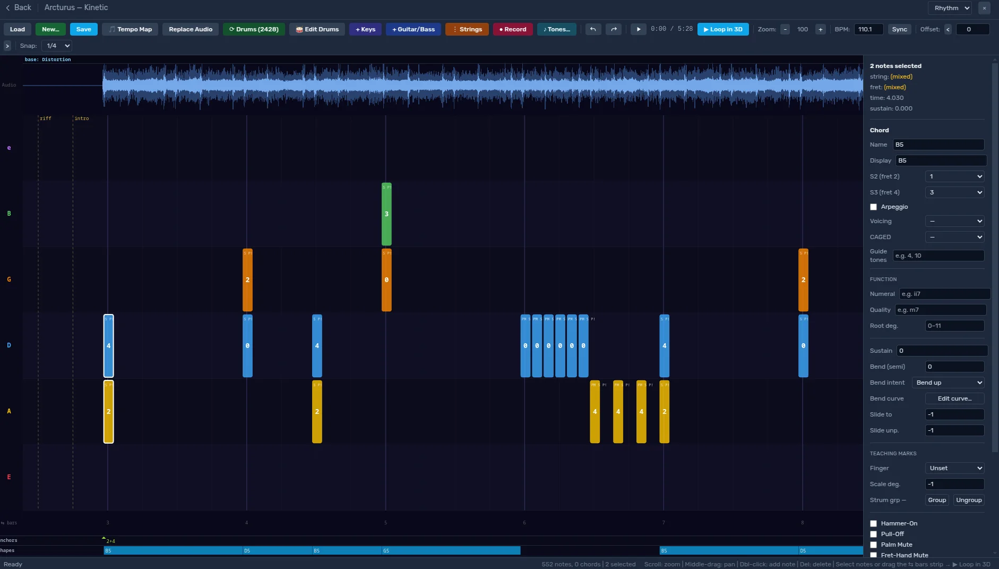
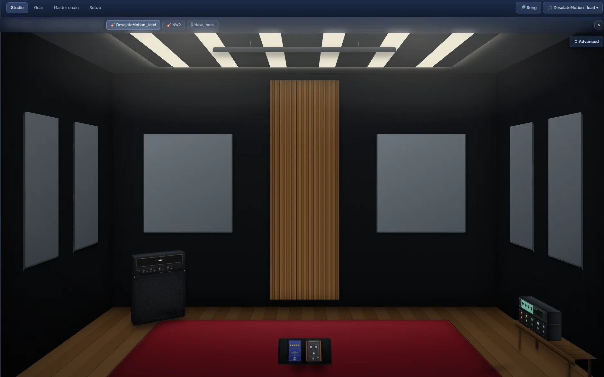

### Rhythm gaming for people who actually play. 🎸🎵🥁🎹🎤

Grab your instrument, plug in, and play. fee\[dB\]ack listens to every note you
play, throws it up on a highway built for *your* instrument, and tells you how
you're doing — in real time. Then it hands you the tools to get better: charts,
stems, drills, theory, and a plugin ecosystem with no ceiling.

 

<!-- TODO: once the invites are live, drop these back in:

 -->

 

---

## 🎉 One platform. Every instrument. Zero gatekeeping.

We built fee\[dB\]ack on a stubborn little belief: **every musician should get to
play.** Not just guitarists. Not just people who read notation. Everyone.

So whatever you picked up first — six strings, four strings, a stack of drums, a
keybed, or your own voice — there's a highway here with your name on it. Practice
your part solo, split the screen with a friend, or wire up the whole band and go.

| | Instrument | How you play |
|---|---|---|
| 🎸 | **Guitar** | Plug in an electric or mic up an acoustic — detection follows every note, bend, and chord as fast as your fingers move. |
| 🎵 | **Bass** | Real bass arrangements with detection tuned for the low end. Lock in with the drums and carry the whole song. |
| 🥁 | **Drums** | Plug an e-kit in over MIDI or mic your acoustic kit — the highway shows every hit, hi-hat to kick. |
| 🎹 | **Keys** | Any MIDI keyboard works. Play piano and keys parts on a highway that mirrors the keybed — every octave, both hands. |
| 🎤 | **Vocals** | Sing lead or harmony with synced lyrics and live pitch detection. See exactly where your melody sits and when to come in. |

## ✨ Play. Then get *ridiculously* good.

- **🛣️ Highways built per instrument** — 3D note highways tuned to how guitar, bass, drums, keys, and vocals are *actually* played. No one-size-fits-none.
- **👂 It's actually listening** — real-time note detection and scoring from any audio interface, mic, or MIDI device. No proprietary dongle required.
- **✍️ Make your own charts** — author arrangements in the built-in editor, or drag in Guitar Pro and MusicXML files and they're playable.
- **🎚️ Practice tools that don't quit** — isolate stems, slow it down *without* the chipmunk pitch, and loop the nasty bar until it's muscle memory.
- **🧠 Theory & lessons** — training that connects what you're playing to *why* it works. Turns out those aren't random notes.
- **🕹️ Minigames** — arcade-style drills that trick you into practicing. You're welcome.
- **🧩 Plugins all the way down** — every single feature is a plugin. Swap 'em, tweak 'em, or write your own.

 <em>Author and edit note charts in the built-in arrangement editor.</em>
  

 <em>Record and mix your band in the Studio.</em>

## 🧩 Built to be torn apart (in a good way)

No two communities play the same way — so we didn't hard-code ours. Extensibility
sits right at the core: a first-class plugin environment where you can bolt on new
gameplay, tools, interfaces, training modes, and ideas nobody's thought of yet.

**If you can write a little JavaScript and Python, you can extend fee\[dB\]ack.**

Here's a taste of what's already in the ecosystem:

| Plugin | What it does |
|---|---|
| [Note Detection](https://github.com/got-feedback/feedBack-plugin-notedetect) | The ears — real-time pitch detection and scoring against the highway |
| [Arrangement Editor](https://github.com/got-feedback/feedBack-plugin-editor) | A DAW-like visual editor for building and tweaking note charts |
| [Import Tab](https://github.com/got-feedback/feedBack-plugin-tabimport) · [MusicXML Import](https://github.com/got-feedback/feedBack-plugin-musicxml-import) | Drag in Guitar Pro / MusicXML files and start playing |
| [Stems & Stem Mixer](https://github.com/got-feedback/feedBack-plugin-stems) | Solo, mute, and remix individual parts of a track |
| [Virtuoso](https://github.com/got-feedback/feedBack-plugin-virtuoso) | A full practice studio for guitar & bass — scales, technique, and rhythm drills |
| [Guitar Theory Lab](https://github.com/got-feedback/feedBack-plugin-guitar-theory) | Scales, chords, intervals, tunings, and voicings on an interactive fretboard |
| [NAM Tone Engine](https://github.com/got-feedback/feedBack-plugin-nam-tone) | In-browser amp modeling with neural amp models and cabinet IRs |
| [Piano Highway](https://github.com/got-feedback/feedBack-plugin-piano) · [Drum Highway](https://github.com/got-feedback/feedBack-plugin-drums) | Dedicated highways for keys and drums, MIDI in |
| [Step Mode](https://github.com/got-feedback/feedBack-plugin-stepmode) | The highway freezes on each note until you nail it — the ultimate slow-cooker |
| [Practice Journal](https://github.com/got-feedback/feedBack-plugin-practice) | Auto-tracks your time, speed, and loops with a stats dashboard |
| [Split Screen](https://github.com/got-feedback/feedBack-plugin-splitscreen) · [Studio](https://github.com/got-feedback/feedBack-plugin-studio) | Play together — split-screen sessions and multi-track band recording |

…and a *lot* more where that came from — browse the full lineup on the
[organization page](https://github.com/orgs/got-feedback/repositories).

## 🚀 How it works

1. **Get the app** — install on Windows, macOS, or Linux, or self-host the web app with Docker.
2. **Add your songs** — import Guitar Pro or MusicXML, grab [feedpak](https://github.com/got-feedback/feedpak-spec) charts, or author your own in the editor.
3. **Plug in and play** — the app listens and scores as you go, on whatever you're holding.

## ⬇️ Get fee\[dB\]ack

We're tuning up for the first public release. Downloads will land on
**[got-feedback.org](https://got-feedback.org/#download)** and right here on GitHub.

| | Platform | |
|---|---|---|
| 🪟 | **Windows** | Installer with auto-updates |
| 🍎 | **macOS** | Universal app — Apple silicon & Intel |
| 🐧 | **Linux** | AppImage — download and run |
| 🐳 | **Docker** | Self-host the web app with one `docker compose up` |

The desktop app bundles everything, including a native low-latency audio engine
for real-instrument input.

## 🔓 Open source, top to bottom

Free to play, free to read, free to build on.

- **[feedBack](https://github.com/got-feedback/feedBack)** — the core app and plugin API.
- **[feedBack-desktop](https://github.com/got-feedback/feedBack-desktop)** — native desktop builds (low-latency audio engine, VST hosting, neural amp modeling).
- **[feedpak-spec](https://github.com/got-feedback/feedpak-spec)** — the open format for interactive charts. Fully documented, zero lock-in.
- **[feedback-user-guide](https://github.com/got-feedback/feedback-user-guide)** — the player's handbook and wiki.

Core app licensed under **[AGPL-3.0](https://www.gnu.org/licenses/agpl-3.0.en.html)**.

## 🤝 Come build with us

New plugin, bug fix, a chart you charted, better docs — it's all welcome. Start
at the [core repo](https://github.com/got-feedback/feedBack) for the plugin API
and contributor guide, then open an issue or PR wherever you'd like to help.

## ❤️ Keep the music playing

fee\[dB\]ack is free, and it's staying that way. If it's helped you play, tossing a
few coins toward development keeps the lights on and the features coming — every
bit goes straight back into the platform. Patreon and Ko-fi links live on the
[website](https://got-feedback.org).

 

**Learn. Improve. Make music together.** 🎶

© 2026 got-feedback

